# 注解

注解是 GDScript 中的一类特殊标记，用来修饰脚本或脚本中的代码，影响 Godot 引擎或编辑器对该脚本或代码所产生的效果。

注解均以 `@` 符号开头，加以注解名称而构成。

**导出属性注解(`@export_...`)均会影响到属性元数据中的`PropertyHint`枚举值**


# 导出属性


导出属性一般是将一个属性以某种特定的编辑方式暴露到Godot检查器中，以便编辑


# `@export`

**仅限于：**

* 属性


将一个属性暴露到`Godot`检查器中，以供编辑并允许将该属性的值保存至磁盘


**（Godot4.5版本以下）该属性必须具有可以推断出类型的初始值或类型声明**


**只允许在派生自`Node`的类导出节点类型的属性**&#x20;

**使用 `class_name` 注册为全局类的自定义资源和自定义节点才能够被导出**


```gdscript
extends Node

enum Direction {LEFT, RIGHT, UP, DOWN}

# 内置类型。
@export var string = ""
@export var int_number = 5
@export var float_number: float = 5
@export var color: Color
@export var vector: Vector2

# 枚举。
@export var type: Variant.Type
@export var format: Image.Format
@export var direction: Direction

# 资源。
@export var image: Image
@export var custom_resource: CustomResource

# 节点。
@export var node: Node
@export var custom_node: CustomNode

# 类型数组。
@export var int_array: Array[int]
@export var direction_array: Array[Direction]
@export var image_array: Array[Image]
@export var node_array: Array[Node]
```


# `@export_group(name: String, prefix: String = "")`

将后续的导出属性进行分组，接收两个参数。

在 参数1`name` 填入一个字符串来指定分组名称，在该注解后的每个导出变量均会被添加到该分组中。

用一个新分组开头，或使用 `@export_group("")` 开头会结束之前的分组的作用范围。


```gdscript
@export_group("My Properties")
@export var number = 3
```


参数2`prefix` 是可选参数，可以填入显示在检查器中的属性名要省略的前缀部分


```gdscript
@export_group("Car Properties", "car_")
@export var car_label = "Speedy" # 显示为label
@export var car_number = 3 # 显示为 number 
```


# `@export_subgroup(name: String, prefix: String = "")`

将后续的属性添加到子分组中。接收两个参数。

在参数1`name`中填入一个字符串来指定子分组名称，使用`/`可以嵌套子分组

参数2`prefix`为可选参数，填入显示在检查器中的属性名要省略的前缀部分。

用一个新分组开头，会结束之前的分组的作用范围。

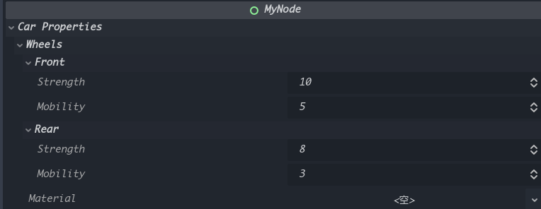

```gdscript
@export_group("Car Properties")
@export_subgroup("Wheels", "wheel_")
@export_subgroup("Wheels/Front", "front_wheel_")
@export var front_wheel_strength = 10
@export var front_wheel_mobility = 5
@export_subgroup("Wheels/Rear", "rear_wheel_")
@export var rear_wheel_strength = 8
@export var rear_wheel_mobility = 3
@export_subgroup("Wheels", "wheel_")
@export var wheel_material: PhysicsMaterial
```


# `@export_category(name: String)`

将后续的属性或分组添加到一个大类别当中。在括号填入一个字符串来指定类别的名称


```gdscript
@export_category("Main Category")
@export var number = 3
@export var string = ""

@export_category("Extra Category")
@export var flag = false
```


# `@export_file(filter: String = "", ...)`

**仅限于：**

* 类型是其中之一的**属性**：

  * `String`

  * `Array[String]`

  * `PackedString`


导出属性，用作指向文件路径，以选择文件的形式在检查器中编辑该属性，仅允许选择项目文件夹及其子文件夹的文件

可以在`filter`中传入文件类型过滤（`*.文件拓展名`），使其只允许选择特定类型的文件。

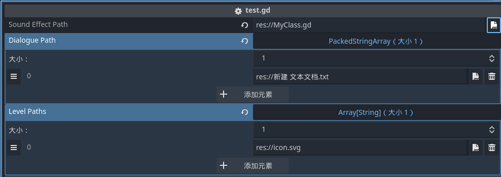

```gdscript
@export_file var sound_effect_path: String
@export_file("*.txt", "*.csv") var dialogue_path: PackedStringArray
@export_file var level_paths: Array[String]
```


# `@export_dir`

**仅限于：**

* 类型是其中之一的**属性**：

  * `String`

  * `Array[String]`

  * `PackedString`


导出属性，用作指向目录路径，以选择目录的形式在检查器中编辑该属性，仅允许选择项目文件夹及其子文件夹的文件夹


```gdscript
@export_dir var sprite_folder_path: String
@export_dir var sprite_folder_paths: Array[String]
```


# `@export_global_file(filter: String = "", ...)`

**仅限于：**

* 类型是其中之一的**属性**：

  * `String`

  * `Array[String]`

  * `PackedString`


导出属性，用作指向文件绝对路径，以选择文件的形式在检查器中编辑该属性，允许选择整个文件系统中的文件

可以在`filter`中传入文件类型过滤（`*.文件拓展名`），使其只允许选择特定类型的文件。


```gdscript
@export_global_file var sound_effect_path: String
@export_global_file("*.txt") var notes_path: String
@export_global_file var multiple_paths: Array[String]
```


# `@export_global_dir`

**仅限于：**

* 类型是其中之一的**属性**：

  * `String`

  * `Array[String]`

  * `PackedString`


导出属性，用作指向目录绝对路径，以选择目录的形式在检查器中编辑该属性，允许选择整个文件系统中的文件夹


```gdscript
@export_global_dir var sprite_folder_path: String
@export_global_dir var sprite_folder_paths: Array[String]
```


# `@export_multiline`

**仅限于：**

* 类型是其中之一的**属性**：

  * `String`

  * `Array[String]`

  * `PackedString`

  * `Array[Dictionary]`

  * `Dictionary`


导出属性，使用多行文本组件来编辑它，便于在检查器中编辑大量文本

应用于类型化字典时，无法在检查器编辑该属性，且如果允许则以Json结构的形式显示在检查器中，否则显示为`<null>`

应用于`Array[Dictionary]`时，编辑方式和普通的`@export`没有区别

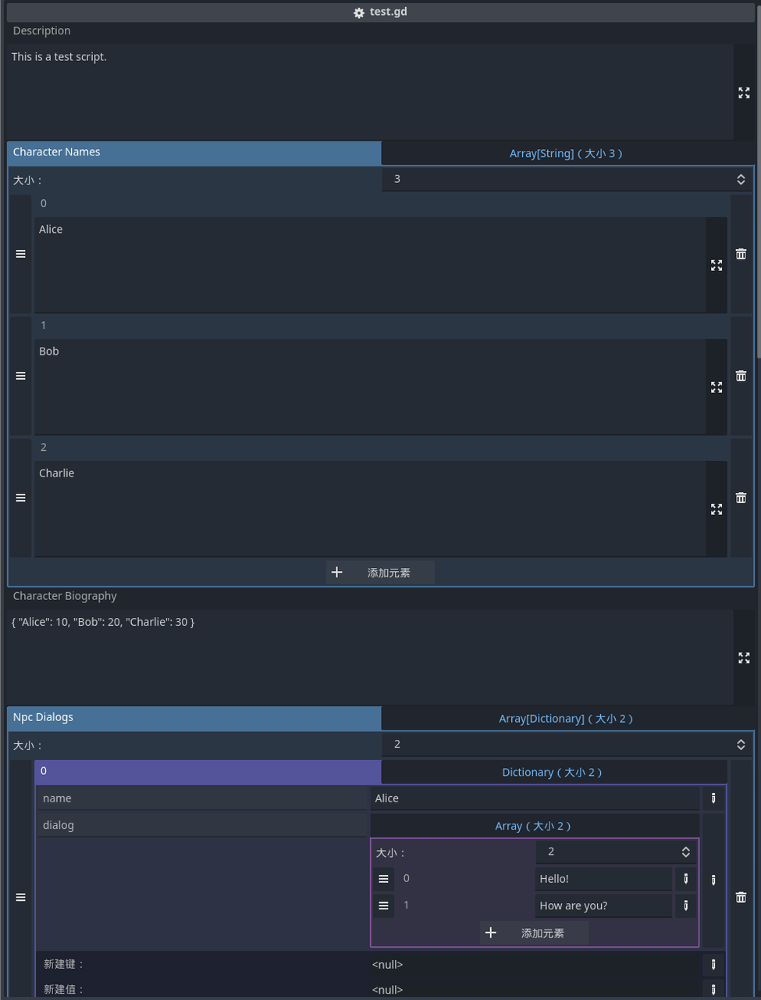

```gdscript
@export_multiline var description: String = "This is a test script."
@export_multiline var character_names: Array[String] = [
    "Alice",
    "Bob",
    "Charlie"
]
@export_multiline var character_biography: Dictionary[String, int] = {
    "Alice": 10,
    "Bob": 20,
    "Charlie": 30
}

@export_multiline var npc_dialogs: Array[Dictionary] = [
    {
        "name": "Alice",
        "dialog": [
            "Hello!",
            "How are you?"
        ]
    },
    {
        "name": "Bob",
        "dialog": [
            "Hi!",
            "I'm fine, thanks!"
        ]
    }
]
```


# `@export_range(min: float, max: float, step: float = 1.0, extra_hints: String = "", ...)`

**仅限于：**

* 类型是其中之一的**属性**：

  * `int`

  * `float`

  * `Array[int]`

  * `Array[float]`

  * `PackedByteArray`

  * `PackedInt32Array`

  * `PackedInt64Array`

  * `PackedFloat32Array`

  * `PackedFloat64Array`


导出属性，并限制值的编辑范围

`min`指定值的最小值

`max`指定值的最大值

`step`指定值的步长，默认为1，默认浮点数步长取决于项目设置[`EditorSettings.interface/inspector/default_float_step`](https://docs.godotengine.org/zh-cn/4.x/classes/class_editorsettings.html#class-editorsettings-property-interface-inspector-default-float-step)的值


除此之外还有以下几种编辑提示，允许以不同的形式编辑该属性，可以同时使用多个编辑提示

* **`or_greater`**：允许输入值大于 `max`，但滑块仍会限制在 `max` 范围内。

* **`or_less`**：允许输入值小于 `min`，但滑块仍会限制在 `min` 范围内。

* **`hide_slider`**：隐藏滑块组件，对于浮点数会移除横向滑动条，对整数会隐藏上下调整箭头。

* **`exp`**：以指数方式改变值，滑动越往右，改变速度越快，适合用于编辑跨度较大的值（如 0.01 \~ 10000）。

* **`radians_as_degrees`**：用于实际存储为“弧度”的值，在检查器中以“角度”形式显示与编辑（会自动进行单位换算，同时加上 ° 符号）。

* **`degrees`**：用于本身就以“角度”单位存储的值，在检查器中加上 ° 后缀，但**不会**进行换算。

* **`suffix:单位`**：在值后面添加一个自定义单位后缀（任意字符串都行），如 `suffix:m` 会显示为“10 m”，可以帮助表达数值的含义。

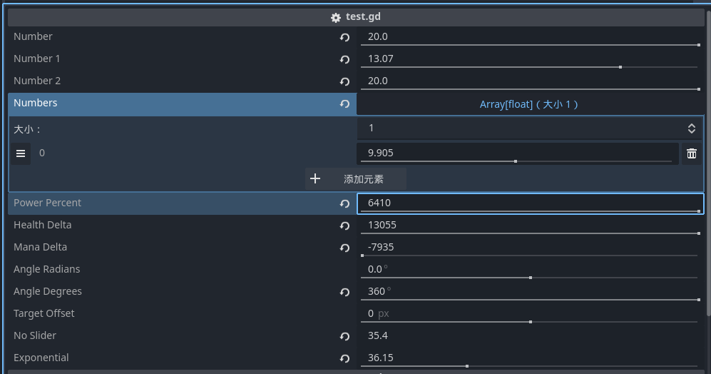

```gdscript
@export_range(0, 20) var number
@export_range(-10, 20) var number_1
@export_range(-10, 20, 0.2) var number_2: float
@export_range(0, 20) var numbers: Array[float]

@export_range(0, 100, 1, "or_greater") var power_percent
@export_range(0, 100, 1, "or_greater", "or_less") var health_delta
@export_range(0, 100, 1, "or_less") var mana_delta

@export_range(-180, 180, 0.001, "radians_as_degrees") var angle_radians
@export_range(0, 360, 1, "degrees") var angle_degrees
@export_range(-8, 8, 2, "suffix:px") var target_offset
@export_range(0, 1000, 0.01, "hide_slider") var no_slider: float
@export_range(0, 100000, 0.01, "exp") var exponential: float
```


# `@export_exp_easing(hints: String = "", ...)`

**仅限于：**&#x20;

* 类型是其中之一的**属性**：

  * `float`

  * `Array[float]`

  * `PackedFloat32Array`

  * `PackedFloat64Array`


导出属性，并一个使用缓动（easing）编辑器的小部件编辑浮点数值，允许以图形化的方式直观表示 `ease()` 函数的曲线


可以使用以下编辑提示（可组合）来自定义小部件行为：

* **`attenuation`**：翻转缓动曲线，适合用于表示“衰减”类的行为（例如：音量递减、速度减缓等），更加直观。

* **`positive_only`**：将可编辑的范围限制为大于等于 0 的正数，适用于不能出现负数的场景。

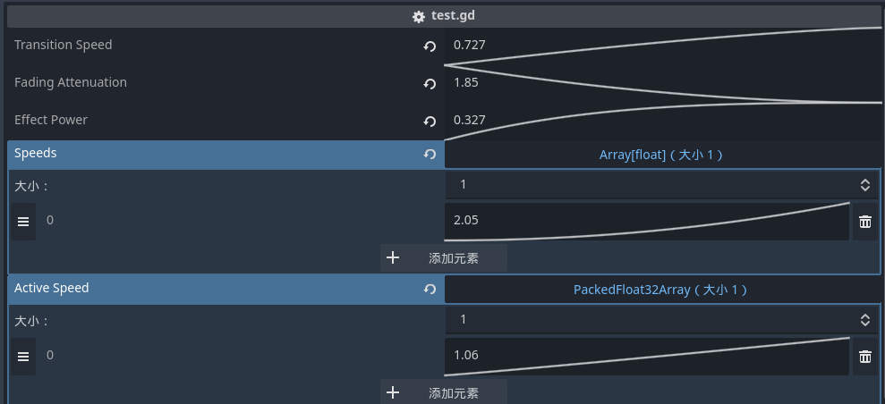

```gdscript
@export_exp_easing var transition_speed
@export_exp_easing("attenuation") var fading_attenuation
@export_exp_easing("positive_only") var effect_power
@export_exp_easing var speeds: Array[float]
@export_exp_easing var active_speed: PackedFloat32Array
```


# **`@export_color_no_alpha`**

**仅限于：**&#x20;

* 类型是其中之一的**属性**：

  * `Color`

  * `Array[Color]`

  * `PackedColorArray`

导出属性，使用颜色选择组件来编辑值，区别于普通的export来导出颜色类型的属性，该注解不允许编辑透明度

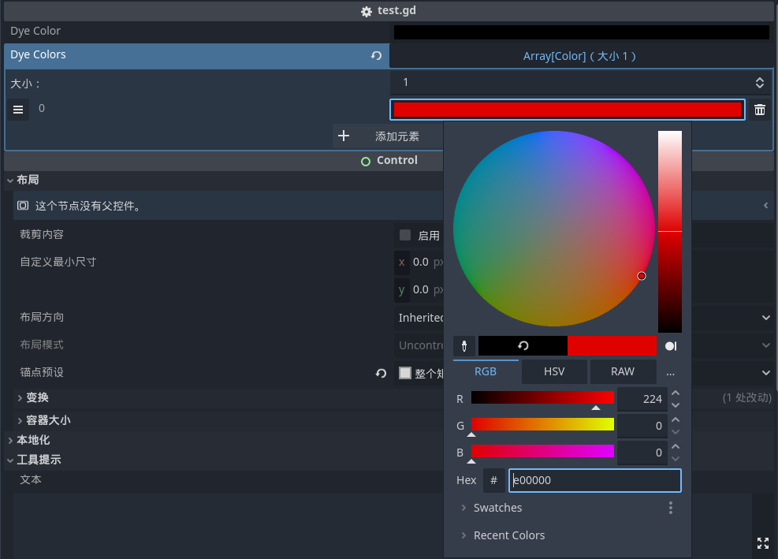

```gdscript
@export_color_no_alpha var dye_color: Color
@export_color_no_alpha var dye_colors: Array[Color]
```


# **`@export_node_path`**`(type: String = "", ...)`

**仅限于：**

* 类型是其中之一的**属性**：

  * `NodePath`

  * `Array[NodePath]`


导出属性，以选择节点路径的形式编辑。

可以设置多个要过滤的节点类型

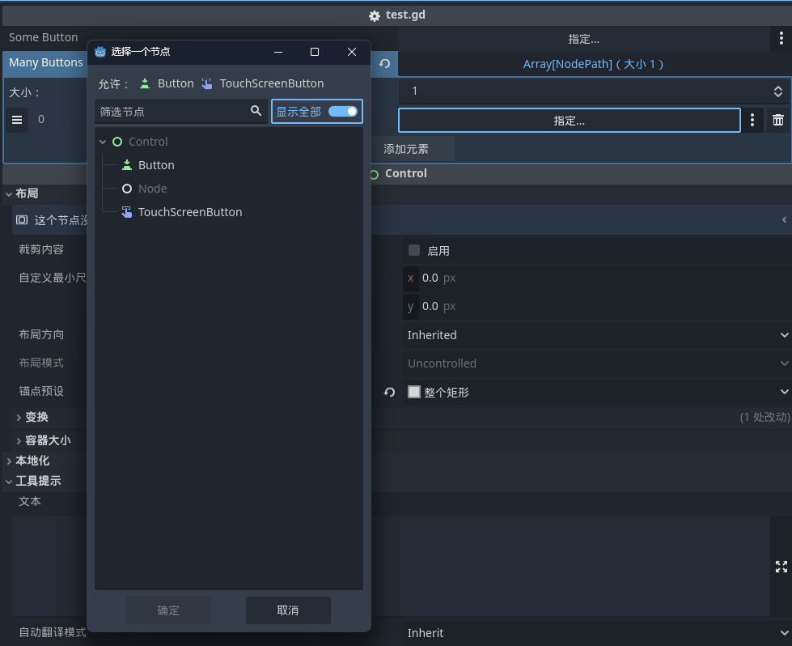

```gdscript
@export_node_path("Button", "TouchScreenButton") var some_button
@export_node_path("Button", "TouchScreenButton") var many_buttons: Array[NodePath]
```


# `@export_flags(names: String, ...) `

**仅限于：**

* 类型是其中之一的**属性**：

  * `int`

  * `Array[int]`

  * `PackedByteArray`

  * `PackedInt32Array`

  * `PackedInt64Array`


导出属性，作为位标志字段，允许在检查器中通过**复选框**的方式编辑属性，可以很方便地表示多个布尔状态组合。

每个选项在底层是一个 **2 的 n 次幂** 的整数值（如 1、2、4、8……），可以保存为单个整数中多个标志位，详见 [位运算符](3.variables-and-basic-data-types/3.4.arithmetic-and-bitwise-operators.md/#二进制运算符)

* **默认值**：如果不手动指定，选项的值会自动按 `1 << n` 顺序增长。

* **自定义值**：使用冒号语法 `"名称:值"` 显式设置值（必须是 2 的幂或组合值，最小为 1）。

* **组合值**：可以直接为某一项设定多个标志组合的值，例如 `"Self and Allies:12"`（即 4 | 8）。

* **注意**：不同于枚举，**后续标志项不会受前一项显式设置的影响**，仍然会按默认方式继续增长

标志位的最小值为`1`，最大值为 `2^32 - 1`

通常情况下应该定义相应的常量，如

```gdscript
enum Element {
    Fire = 1 << 0,
    Water = 1 << 1,
    Earth = 1 << 2,
    Wind = 1 << 3
}
```

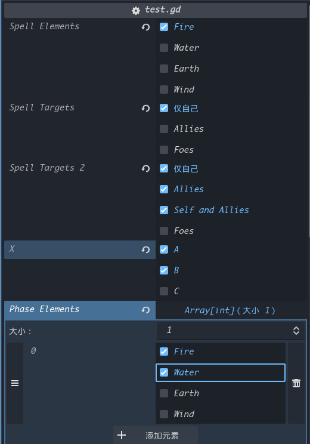

```gdscript
# 1, 2, 4, 8
@export_flags("Fire", "Water", "Earth", "Wind") var spell_elements = 0
# 4, 8, 16
@export_flags("Self:4", "Allies:8", "Foes:16") var spell_targets = 0
# 4, 8, 12, 16
@export_flags("Self:4", "Allies:8", "Self and Allies:12", "Foes:16")
var spell_targets_2 = 0
# 16, 2, 4
@export_flags("A:16", "B", "C") var x
# 1, 2, 4, 8
@export_flags("Fire", "Water", "Earth", "Wind") var phase_elements: Array[int]
```


# 导出层级遮罩

**`@export_flags_2d_physics`**

**`@export_flags_2d_render`**

**`@export_flags_2d_navigation`**

**`@export_flags_3d_physics`**

**`@export_flags_3d_render`**

**`@export_flags_3d_navigation`**

**`@export_flags_avoidance`**

**仅限于：**

* 类型是其中之一的**属性**：

  * `int`

  * `Array[int]`

  * `PackedByteArray`

  * `PackedInt32Array`

  * `PackedInt64Array`


导出**层级遮罩字段**，包括物理层、渲染层、导航层和避障层。它们会在检查器中显示为一组层级名称的复选框，方便我们通过点击勾选的方式来控制对象所在的层

适用于 Godot 中的各种层系统，像是：

* **2D**：物理层 / 渲染层 / 导航层

* **3D**：物理层 / 渲染层 / 导航层

* **Avoidance**：避障层，用于动态避障相关功能（如`NavigationAgent2D`节点）

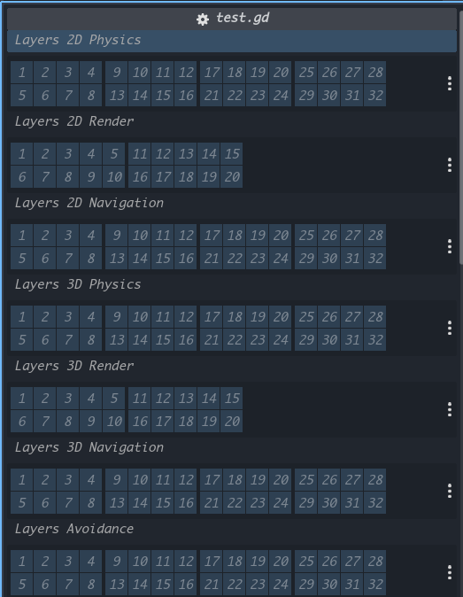


```gdscript
@export_flags_2d_physics var layers_2d_physics
@export_flags_2d_render var layers_2d_render
@export_flags_2d_navigation var layers_2d_navigation
@export_flags_3d_physics var layers_3d_physics
@export_flags_3d_render var layers_3d_render
@export_flags_3d_navigation var layers_3d_navigation
@export_flags_avoidance var layers_avoidance
```

# **`@export_enum`**`(names: String, ...)`

**仅限于：**

* 类型是其中之一的**属性**：

  * `int`

  * `String`

  * `Array[int]`

  * `PackedByteArray`

  * `PackedInt32Array`

  * `PackedInt64Array`

  * `PackedStringArray`


导出整数或字符串类型属性，允许像导出普通的枚举类型属性一样在编辑器中使用下拉菜单选择给定项

需要在参数中填入可选的枚举项

* 若属性是整数，则值对应所选项的索引（比如 0、1、2...）

* 若属性是字符串，则值即为被选中的选项字符串本身

枚举值默认是从 `0` 开始依次递增的，也可以手动指定某一项的具体数值，注意后面的值会受到前面显式值的影响，行为和你声明一个 `enum` 时一模一样

如果要导出具名的枚举，直接对枚举类型属性使用`@export`即可

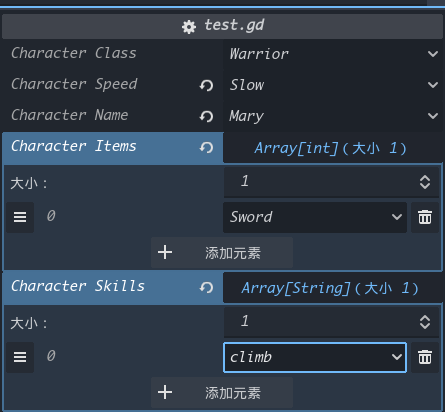

```gdscript
@export_enum("Warrior", "Magician", "Thief") var character_class: int
@export_enum("Slow:30", "Average:60", "Very Fast:200") var character_speed: int
@export_enum("Rebecca", "Mary", "Leah") var character_name: String

@export_enum("Sword", "Spear", "Mace") var character_items: Array[int]
@export_enum("double_jump", "climb", "dash") var character_skills: Array[String]
```

# **`@export_storage`**

**仅限于：**

* 属性


导出属性，与普通的`export`不同，它会将属性的值序列化储存进场景或资源文件中，但不会显示在编辑器中。

这在工具脚本中非常有用，以防误修改其值，同时避免检查器杂乱无章。

同时，`Resource.duplicate()`和`Node.duplicate()`，也会复制这个属性的值，不会像普通的`var`一样被忽略。

```gdscript
var a # 不保存进文件，不在编辑器中显示。
@export_storage var b # 保存进文件，不在编辑器中显示。
@export var c: int # 保存进文件，在编辑器中显示。
```

# `@export_custom(hint: PropertyHint, hint_string: String, usage: BitField[PropertyUsageFlags] = 6)`

**仅限于：**&#x20;

* 属性


当你觉得内建的 `@export` 注解不够用，想要**更灵活、更底层地控制**导出行为时，可以使用该注解

它允许你自定义：

* 提示类型（`PropertyHint`，比如 RANGE、ENUM、LINK 等）

* 提示字符串（`hint_string`，比如单位、枚举项、范围值等）

* 使用标志（`PropertyUsageFlags`，比如是否显示在编辑器中、是否在编辑器中只读等）

**注意：**

* **&#x20;GDScript 不会验证你填的参数是否正确！如果写错了语法，编辑器可能会有奇怪行为。**

* **无论 `usage` 值如何，属性总会有 PROPERTY\_USAGE\_SCRIPT\_VARIABLE 标志，就像和任何显式声明的脚本变量一样。**


下面的例子演示了将一个向量导出到编辑器中，并添加了单位后缀以及链接所有分量，允许同时编辑它们


```gdscript
@export_custom(PROPERTY_HINT_LINK, "suffix:m") var vector: Vector3
```


# `@export_tool_button(text: String, icon: String = "")`

**仅限于：**

* 属性，并且满足以下全部条件：

  * 定义于 `@tool` 脚本中

  * 类型是 `Callable`


这个注解会在**编辑器的检查器面板**中添加一个小按钮
当你点击这个按钮时，绑定的 `Callable` 就会被调用。适合调试、快速触发脚本逻辑，或者开发工具类节点时做可视化操作

* `text` 是按钮上显示的文字

* `icon` 是按钮图标的名字（来自编辑器的 `"EditorIcons"` 主题），可以不填，默认为 `"Callable"` 图标

* 使用 `EditorInterface.get_editor_undo_redo()` 能让操作支持撤销重做


这种导出不会添加 `PROPERTY_USAGE_STORAGE` 标志（因为 `Callable` 无法序列化！）

导出的项目中不会包含 `EditorInterface` 和 `EditorUndoRedoManager`，所以要在工具脚本中使用

可以用`var undo_redo = Engine.get_singleton(&"EditorInterface").get_editor_undo_redo()`来避免静态类型依赖

**千万不要**在 `RefCounted`（比如 `Resource`）类中保存 lambda 形式的 `Callable`到成员变量中，会引起内存泄漏！记得只用方法引用或者 `.bind()`/`.unbind()` 后的 `Callable`


```gdscript
@tool
extends Sprite2D

@export_tool_button("Hello", "Callable") 
var hello_action = hello

@export_tool_button("随机颜色", "ColorRect")
var randomize_color_action = randomize_color

func hello():
        print("Hello world!")  

func randomize_color():
        var undo_redo = EditorInterface.get_editor_undo_redo()
        undo_redo.create_action("Randomized Sprite2D Color")
        undo_redo.add_do_property(self, &"self_modulate", Color(randf(), randf(), randf()))
        undo_redo.add_undo_property(self, &"self_modulate", self_modulate)
        undo_redo.commit_action()

```


# **`@export_placeholder`**`(placeholder: String)`

**仅限于：**

* 类型是其中之一的**属性**：

  * `String`

  * `Array[String]`

  * `PackedStringArray`


导出字符串属性，当属性没有值的时候会在编辑器的文本编辑框中显示指定的占位符文本。

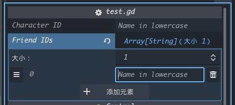

```gdscript
@export_placeholder("Name in lowercase") var character_id: String
@export_placeholder("Name in lowercase") var friend_ids: Array[String]
```


# `@abstract`

**仅限于：**

* 实例方法

* 类

* Godot 4.5 或更高版本


标记类或方法为抽象类/抽象方法

抽象类无法被直接实例化，抽象方法不能声明主体


# `@icon(icon_path: String)`

仅限于：

* **脚本类定义和继承语句之前使用**

* 只能作用于 **脚本文件的主类**（不支持内部类或嵌套类）


允许为你的脚本文件自定义一个图标，该图标会在场景树、检查器、内置文档以及各种编辑器对话框中展示

适合和`class_name`搭配使用

参数必须是字符串字面量，不能是脚本中定义的变量或常量表达式
`@icon("res://icon.svg")`✔️
`@icon(ICON_PATH)`❌

注解必须位于`class_name`和`extends`之前


```gdscript
@icon("res://icon.svg")
class_name MyNode
extends Control

@export var my_property := 1
```


# `@onready`

**仅限于：**&#x20;

* 属性

  * 定义在继承自`Node`及其子类的类中


让属性的值 **延迟到节点进入场景树并调用 `_ready()` 的时刻进行初始化**，而不是在`_init()` 的时候。

常用于获取节点的引用。

请勿将该注解和`@export`一起使用，`@export` 会在编辑器中设置变量值，而 `@onready` 会在 `_ready()` 时设置变量初始值，这会导致`@export`设置的值被`@onready`覆盖

```gdscript
@onready var my_label := $MyLabel
```


# `@rpc(mode: String = "authority", sync: String = "call_remote", transfer_mode: String = "unreliable", transfer_channel: int = 0) `


**仅限于：**&#x20;

* 方法


把一个方法变成 **远程过程调用（RPC）。**&#x5728;多人游戏中，可以让一个玩家的行为在其他玩家那边同步发生

> 你写的函数，不只你能叫，别人也可以通过网络远程喊你来执行


* `mode`：默认值`"authority"`，控制谁可以调用这个方法。`"authority"` 只允许控制权对等体（主机）调用；`"any_peer"` 所有人都能调用

* `sync`：默认值`"call_remote"`，是否在本地也执行，默认只远程执行。改成 `"call_local"` 可在本地和远程都执行

* `transfer_mode`：默认值`"unreliable"`，控制网络传输质量/稳定性

  * &#x20;`"unreliable"`（快速但可能丢包）

  * &#x20;`"unreliable_ordered"`（有顺序，速度还行）

  * &#x20;`"reliable"`（确保送达，但稍慢）

* `transfer_channel`：默认值`0`，网络通道编号，通常你不需要改

前三个参数顺序可乱，`transfer_channel` 必须是**第4个**而且**前三个必须都写**时才可使用！

不允许写重复的参数（比如两个 mode）


RPC只能由`Callable.rpc()`、`Callable.rpc_id()`、`Node.rpc()`、`Node.rpc_id()`触发

```gdscript
@rpc
func fn(): pass

@rpc("any_peer", "unreliable_ordered")
func fn_update_pos(): pass

@rpc("authority", "call_remote", "unreliable", 0) # 等价于 @rpc
func fn_default(): pass
```


# `@static_unload`

**仅限于：**&#x20;

* **脚本类定义和继承语句之前使用**


> **由于一个bug即使使用了该注解，脚本也永远不会被释放，因此该注解在目前版本(`Godot 4.x`)中暂时不起效**


让脚本中的 **静态变量在失去所有引用后不再保留**。 如果脚本再次被加载，**这些静态变量将重置为默认值**


在 GDScript 中，脚本是资源（resource），只要里面存在静态变量，即使没有任何实例或引用，也**不会被卸载**！

* 如果静态变量保存了**大数据**或对其它资源（比如场景、图像）的引用，这可能会导致内存占用持续增长。

* 若这些静态变量只是暂时性、不重要的数据，你就可以加上 `@static_unload`，让脚本在没有引用后彻底被卸载，变量也就能清空重置


示例：

当所有 `MyManager` 的引用都消失后，若再次加载脚本，`some_cache` 就会回到 `{}` 初始状态

```gdscript
@static_unload
class_name MyManager
extends Node

static var some_cache = {}
```


# `@tool`

**仅限于：**&#x20;

* **脚本类定义和继承语句之前使用**


将当前脚本标记为工具脚本，允许该脚本在编辑器内执行代码，而非仅限运行时。这在制作插件时非常有用。


工具脚本可以在编辑器内部执行代码，并且能够访问当前编辑场景的场景树，这意味着你可以实时展示节点在编辑时的变化

但要注意！编辑器**没有针对工具脚本的潜在误用提供保护措施**。

在操作场景树时要格外小心，尤其在编辑器运行涉及该节点的逻辑时释放该节点，可能会导致 Godot 崩溃。


如果只想在编辑器环境内执行某些代码可以使用以下语句，如果只想在游戏内执行代码直接否定该语句即可

```gdscript
if Engine.is_editor_hint():
        pass # 要在编辑器环境执行的逻辑
        
if not Engine.is_editor_hint():
        pass # 要在运行时执行的逻辑
```


拓展其他工具脚本时，也必须将该脚本标注为`@tool`，否则不会继承工具行为

工具脚本的行为会**永久改变场景**，哪怕你删了脚本，节点的变动（比如旋转）也会保留


# `@warning_ignore(warning: String, ...) `

**仅限于：**&#x20;

* 紧贴在某条语句上方使用


忽略该语句触发的指定警告。例如当某行代码理论上不会执行（如在 return 之后）时、进行整数除法时，可以用来禁止相关警告。

用于忽略单条语句的警告（推荐这种方式用于局部忽略）。

&#x20;参数必须是字符串字面量，不能是表达式。

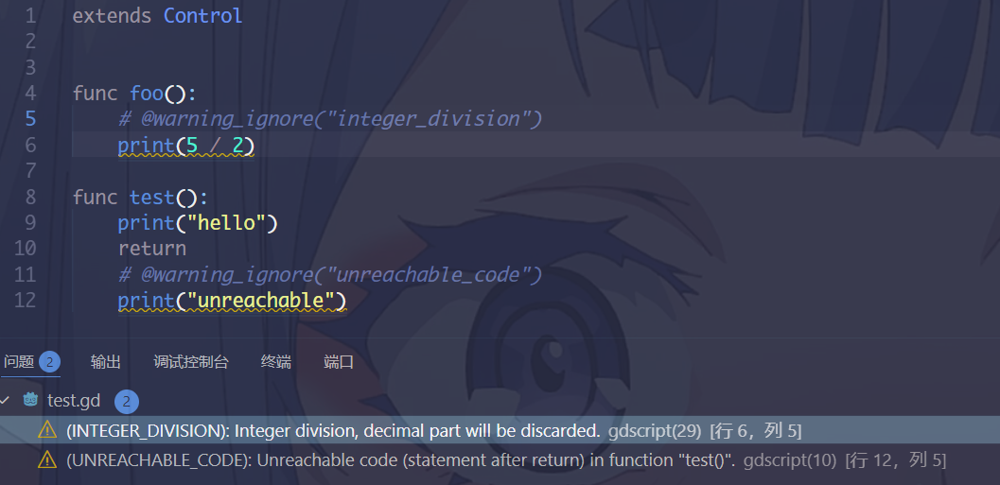


```gdscript
func foo():
    @warning_ignore("integer_division")
    print(5 / 2)
    
func test():
    print("hello")
    return
    @warning_ignore("unreachable_code")
    print("unreachable") # 不会触发警告
```


# `@warning_ignore_start(warning: String, ...)`

**仅限于：**&#x20;

* 脚本任意位置，但需符合所在位置缩进等级

* 有效范围持续到 `@warning_ignore_restore` 或文件末尾


开始忽略指定类型的警告，适用于一段代码。通常配合 `@warning_ignore_restore` 使用。

&#x20;参数必须是字符串字面量，不能是表达式。

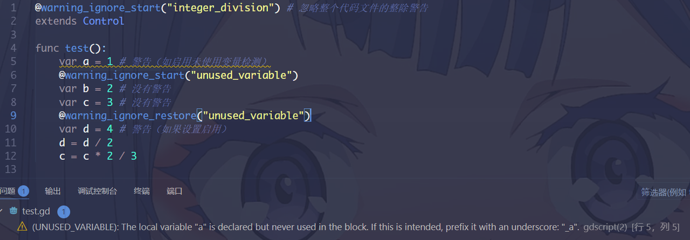

```gdscript
@warning_ignore_start("integer_division") # 忽略整个代码文件的整除警告
extends Control

func test():
    var a = 1 # 警告（如启用未使用变量检测）
    @warning_ignore_start("unused_variable")
    var b = 2 # 没有警告
    var c = 3 # 没有警告
    @warning_ignore_restore("unused_variable")
    var d = 4 # 警告（如果设置启用）
    d = d / 2
    c = c * 2 / 3

```


# `@warning_ignore_restore(warning: String, ...)`

**仅限于：**&#x20;

* 在 `@warning_ignore_start` 之后使用


恢复对指定类型警告的检测，重置为项目设置中配置的状态。如果不使用这个注解，忽略将持续到文件末尾。

和上面一样，参数必须是字符串字面量。

不允许单独出现，前面必须要有一个`@warning_ignore_start `
