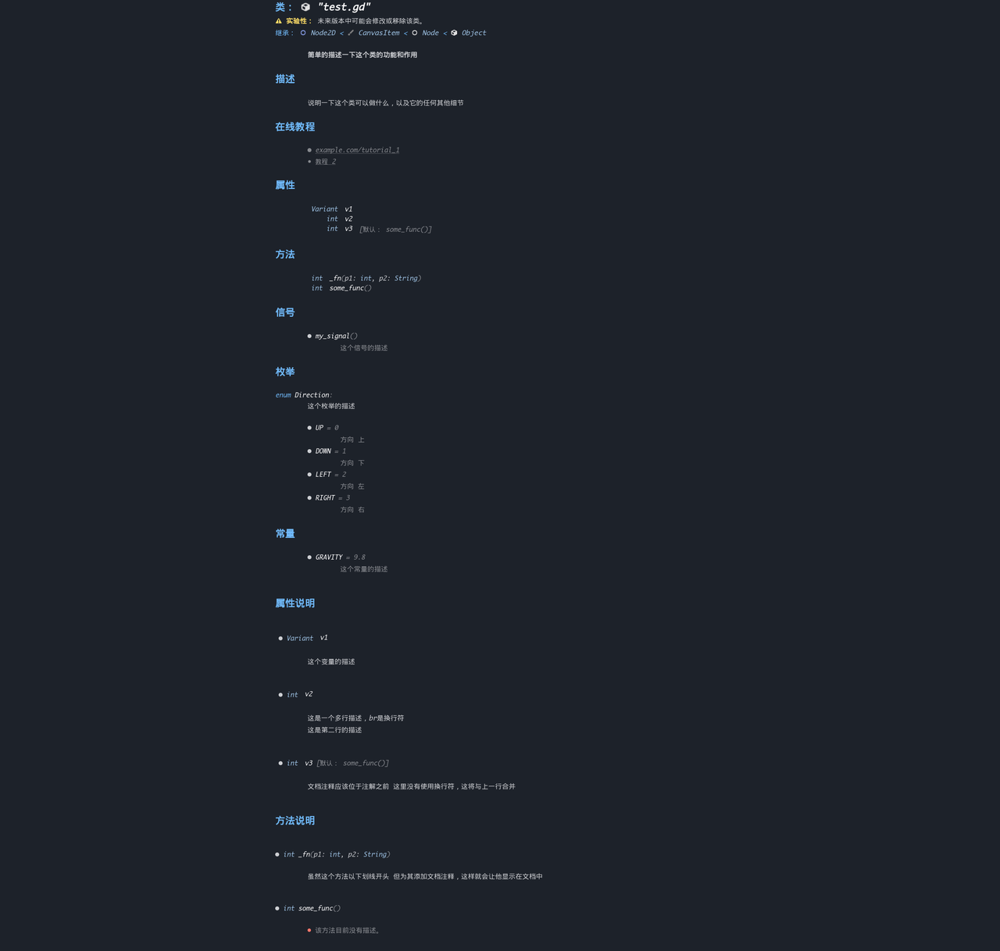
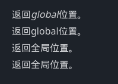
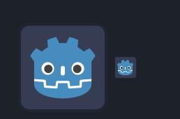

# 文档注释

在GDScript中，可以使用特别的注释语法来为 **类** 、**方法** 、**属性** 等成员添加结构化的文档说明，这种注释叫作文档注释（Documentation Comments），它们不仅能让代码更清晰易懂，还能被编辑器、脚本或文档生成工具自动解析，展示在代码编辑器的提示气泡或编辑器的离线文档中，更是团队协作的一大助力！



```gdscript
## 简单的描述一下这个类的功能和作用
##
## 说明一下这个类可以做什么，以及它的任何其他细节
##
## @tutorial:             https://example.com/tutorial_1
## @tutorial(教程 2): https://example.com/tutorial_2
## @experimental
extends Node2D

## 这个信号的描述
signal my_signal

## 这个枚举的描述
enum Direction {
        ## 方向 上
        UP = 0,
        ## 方向 下
        DOWN = 1,
        ## 方向 左
        LEFT = 2,
        ## 方向 右
        RIGHT = 3,
}

## 这个常量的描述
const GRAVITY = 9.8

## 这个变量的描述
var v1

## 这是一个多行描述，br是换行符 [br]
## 这是第二行的描述
var v2: int

## 文档注释应该位于注解之前
## 这里没有使用换行符，这将与上一行合并
@export var v3 := some_func()

func some_func() -> int:
    return 0

## 虽然这个方法以下划线开头
## 但为其添加文档注释，这样就会让他显示在帮助窗口中
func _fn(p1: int, p2: String) -> int:
    return 0

# 下面这个方法以下划线开头
# 并且没有为其添加文档注释，因此它不会显示在帮助窗口中
func _internal() -> void:
    pass

## 内部类的文档，这会显示在一个独立的文档窗口中
##
## 类文档描述的规则也适用于这里，
## 文档必须位于类定义之前
##
## @tutorial: https://example.com/tutorial
## @experimental
class Inner:

    ## 内部类的变量
    var v4

    ## 内部类的方法
    func fn(): pass
```


***

使用文档注释编写脚本文档时，必须写于成员声明之前。

文档注释均以`##`开头，单个`#`为普通注释。

特殊标记需要写于文本行开头（忽略之前的空格），并且需要使用`@`符号，后接标记名。

文档注释若描述超过一行，则该行文档注释文本的末尾空格与下一行文档注释文本的开头空格将会在显示时自动合成一个空格，且不会换行。若必须换行，请使用换行符 `[br]`。也可见下方的 BBCode参考。

# 特殊标记

可以将一个类或其成员标记为已弃用成员或者实验性成员，标记后，引擎就会在文档查看器里自动添加上对应提示符号。

你也可以选择性地提供一条对不再支持该 API 的原因解释。这些对插件和代码库的作者而言无疑是一大福音。

可用的特殊标记有以下几种：

| 标记              | 说明                                                            | 可用于       | 示例                                                                       |
| --------------- | ------------------------------------------------------------- | --------- | ------------------------------------------------------------------------ |
| `@tutorial`     | 教程链接                                                          | 类文档       | `@tutorial: https://example.com` `@tutorial(标题写在此处): https://example.com` |
| `@deprecated`   | 已弃用标记不推荐的 API，该 API 可能会在未来的主要版本中移除或进行不兼容的更改。保留 API 通常是为了向后兼容。 | 类文档，类成员文档 | `@deprecated` `@deprecated: 请改用 [AnotherClass]。`                          |
| `@experimental` | 实验性标记了一个不稳定的新 API，该 API 可能会在当前主要分支中更改或移除。不建议在生产代码中使用该 API。    | 类文档，类成员文档 | `@experimental` `@experimental: 该类不稳定`                                    |

你可以给同一个类/成员同时使用 `@deprecated` 和`@experimental` 这两个标记，不过并不推荐这样做，会比较反直觉。

若标记名和冒号中间存在空格，如 `@tutorial  :`，则不会将该标记视为有效标记，该无效标记将会被引擎忽略。

# BBCode参考

Godot支持在文档注释中使用BBCode标签来生成漂亮的文档

每从其他类里链接一个成员，你都要在成员名前面加上该类的类名。而链接类内成员时，类名可省略。

标签支持嵌套（`[b][u]文本[/u][/b]`），但不支持纠缠（`[b][u]文本[/b][/u]`）

起始标签和结束标签应该成对出现，否则效果将作用于整个文本


### `[Class]`

链接到类


```gdscript
## 这将链接到其他类：[Node2D]
```


### `[annotation Class.name]`

&#x20;链接到注解，目前（Godot4.x）只有`@GDScript`有注解


```gdscript
## 这将链接到注解：[annotation @GDScript.@export].
```


### `[constant Class.name]`

链接到常量


```gdscript
## 这将链接到常量： [constant Color.RED]。
```


### `[enum Class.name]`

链接到枚举


```gdscript
## 这将链接到枚举： [enum @GlobalScope.Error]。
```


### `[member Class.name]`

链接到成员


```gdscript
## 这将链接到成员： [member Node2D.scale]。
```


### `[method Class.name]`

链接到方法


```gdscript
## 这将链接到方法： [method Node2D.look_at]。
```


### `[constructor Class.name]`

链接到内置类型的构造函数


```gdscript
## 这将链接到内置构造函数： [constructor Vector2.Vector2]，仅限内置类型！
```


### `[operator Class.name]`

链接到内置运算符。

由于Godot所使用的BBCode不支持标签参数的转义，因此不能链接到 \[] 运算符


```gdscript
## 这将链接到内置运算符： [operator String.operator +]
```


### `[signal Class.name]`

链接到信号


```gdscript
## 这将链接到信号： [signal SceneTree.process_frame]
```


### `[theme_item Class.name]`

链接到主题项


```gdscript
## 这将链接到主题项： [theme_item Label.font]
```


### `[param name]`

参数引用，一般用作引用方法的参数


```gdscript
## 返回 [param a] 和 [param b] 相加的结果
```


### `[br]`

文档注释不会自动换行，需要使用该标签强制进行换行


```gdscript
## 我是第一行文本 [br]我是第二行文本 [br]
## 推荐在行末写上 br 然后再手动换行
```


### `[lb]` `[rb]`

分别为 `[`和`]`的转义标签，**但是使用在标签的参数中时是无效的**


```gdscript
## 你可以使用这个标签来加粗文本：[lb]b[rb]text[lb]/b[rb]
```


### `[b]` `[/b]`

粗体


```gdscript
## [b]请勿[/b]调用该方法。
```


### `[i]` `[/i]`&#x20;

斜体，对中文使用效果不是很好



```gdscript
## 返回[i]global[/i]位置。[br]
## 返回global位置。[br]
## 返回[i]全局[/i]位置。[br]
## 返回全局位置。
```


### `[u]` `[/u]`

下划线


```gdscript
## [u][b]始终[/b]调用该方法。[/u]
```


### `[s]` `[/s]`

删除线


```gdscript
## [s]这条划掉！[/s]
```


### `[color=颜色代码]` `[/color]`

颜色，可以使用BBCode颜色代码，或者十六进制颜色代码（可以省略井号）


```gdscript
## [color=#FF2900] 红色！[/color] [br]
## [color=red] 红色！[/color] [br]
## [color=FF2900] 红色！[/color]
```


### `[font=资源路径]` `[/font]`

更改文本所使用的字体，路径不能使用引号，可以使用相对路径


```gdscript
## [font=font/ZhiMangXing-Regular.ttf][color=#FF2900] 这段文本是红色的，字体也很酷炫！ 
```

### `[img width=高度]图像路径[/img]`

插入图像，路径不能使用引号，可以使用相对路径，图像高度可以不显式指定



```gdscript
## [img]icon.svg[/img] [img width=32]icon.svg[/img]
```

### `[url]网址[/url]`

超链接

可以将网址作为起始标签的参数：`[url=网址]显示文本[/url]`，这样标签包裹的部分就是超链接显示的文本内容了


```gdscript
## [url]https://example.com[/url][br]
## [url=https://example.com]网站[/url]
```

### `[center]` `[/center]`

令文本水平居中


```gdscript
## [center]2 + 2 = 4[/center]
```


### `[kbd]` `[/kbd]`

键盘和鼠标快捷键，在此之间的BBCode标签均无效


```gdscript
## 按下 [kbd]Ctrl + C[/kbd] 组合键。
```


### `[code]` `[/code]`

嵌入代码片段，在此之间的BBCode代码均无效


```gdscript
## 你可以使用 [code]get_tree().current_scene[/code] 来获取当前的场景
```


### `[codeblock][/codeblock]`

多行代码块，请始终在代码块中使用四个空格进行缩进，而不是制表符

默认高亮GDScript语法，你可以使用`lang`修饰符来对其语法高亮的语言进行修改

* `[codeblock lang=text]` 禁用语法高亮;

* `[codeblock lang=gdscript]` 高亮 GDScript 语法;

* `[codeblock lang=csharp]` 高亮 C# 语法（仅.NET版本有效）。


```gdscript
## 示例代码：
## [codeblock]
## func _ready():
##     var sprite = get_node("Sprite2D")
##     print(sprite.get_pos())
## [/codeblock]
```


### `[codeblocks][/codeblocks]`

多行代码块，用于展示不同语言（C#/GDScript）的相同示例，请始终在代码块中使用四个空格进行缩进，而不是制表符

需要为代码至少添加一种语言标签（`[gdscript]`或`[csharp]`）

**这个标签，似乎换行处理有问题，用户编写的内容无法在帮助窗口中正确渲染**&#x20;


```gdscript
## 示例代码：[br]
## [br]
## [codeblocks]
## [gdscript]
## func _ready():
##     var sprite = get_node("Sprite2D")
##     print(sprite.get_pos())
## [/gdscript]
## [csharp]
## public override void _Ready()
## {
##     var sprite = GetNode("Sprite2D");
##     GD.Print(sprite.GetPos());
## }
## [/csharp]
## [/codeblocks]
```

# 类文档

类文档需要在类的其他成员声明之前，通常置于文件开头。


类文档分为三个部分

* 脚本类概述：文档开头

* 脚本类详细描述：用一行空的文档注释行来与类概述隔开

* 教程与特殊标记——弃用/实验性：使用特殊标记，一般情况下可以省略这一部分

```gdscript
## 类概述说明
## 
## 类详细描述
## 
## @tutorial:             https://example.com/tutorial_1
## @tutorial(Tutorial 2): https://example.com/tutorial_2
## @experimental
```


例如

```gdscript
## 简单的描述一下这个类的功能和作用
##
## 说明一下这个类可以做什么，以及它的任何其他细节
class_name MyClass
extends Node2D
```


# 类成员文档

脚本类的成员也可用使用文档注释来生成对应的文档说明，这些内容会在编辑器的离线文档中同步更改

* 信号

* 枚举

* 枚举值

* 常量

* 变量

* 函数

* 内部类（这会单独开一篇文档）

若存在以下划线开头的变量或函数，则该成员将会被视为私有成员，不会显示在该脚本的脚本类文档当中，但如果为其添加了文档注释，那么它仍会显示在文档当中


为类成员编写文档注释时，应写在该成员以及修饰该成员的注解（如果有）之前。

文档可以进行多行编写，但每一行均需以双井号`##`开头，文本在显示时不会自动换行，需要使用\[br]进行换行！

类成员文档也可以使用 弃用（`@deprecated`），和 实验性（`@experimental`） 这两个特殊标记。

例如：

```gdscript
## 这个变量的描述
## @deprecated: 这个变量已经弃用直接使用[member other_var]
var my_var
```

或者你也可以使用内联的文档注释，将成员声明和文档注释写在同一行：

```gdscript
signal my_signal ## My signal.

enum MyEnum { ## My enum.
        VALUE_A = 0, ## Value A.
        VALUE_B = 1, ## Value B.
}

const MY_CONST = 1 ## My constant.

var my_var ## My variable.


func my_func(): ## My func.
        pass


class MyClass: ## My class.
        pass
```
