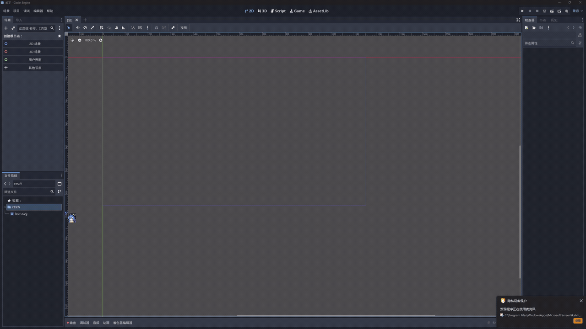
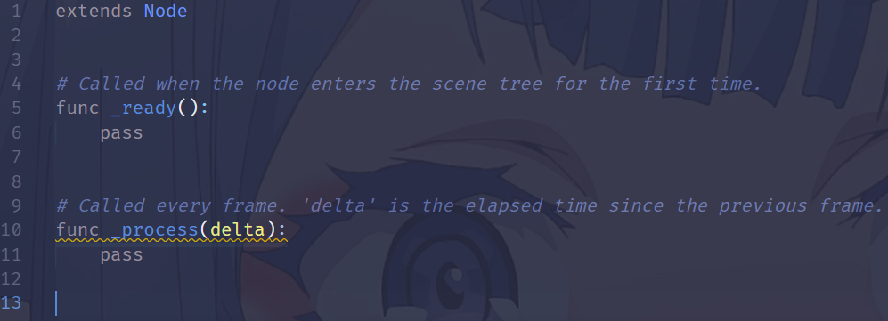
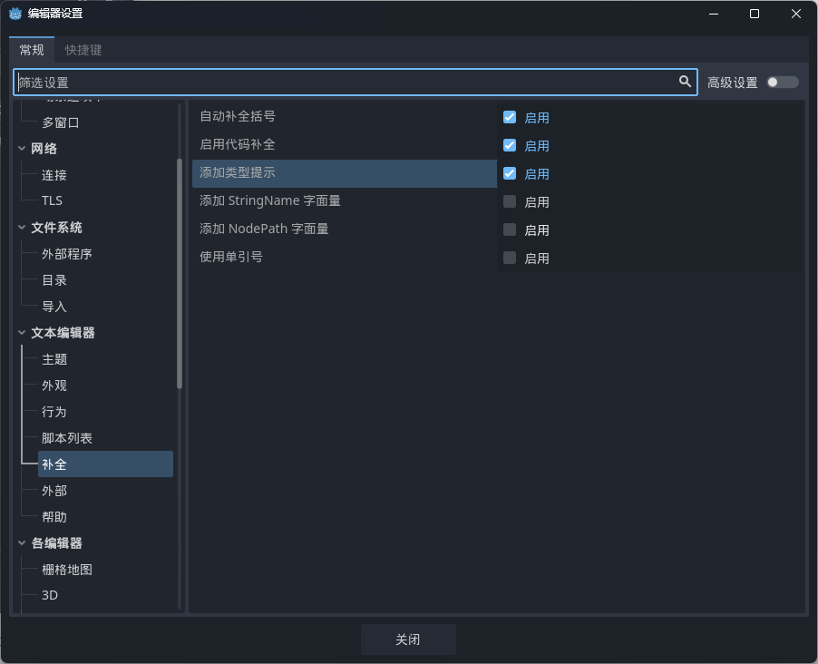
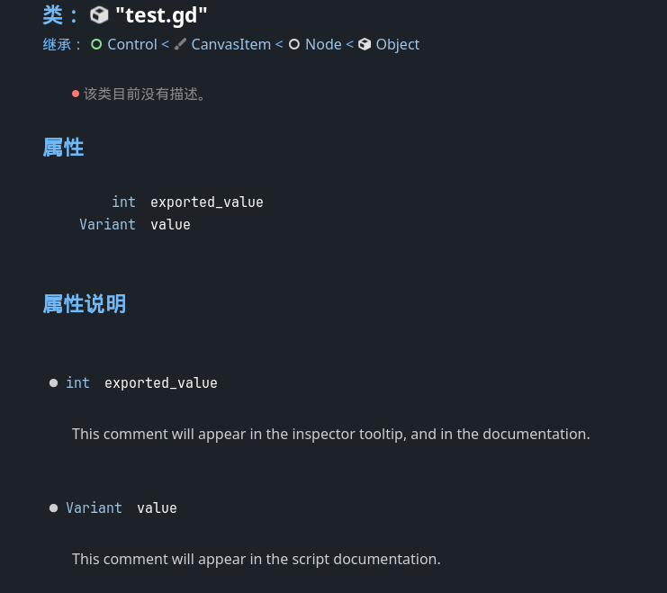
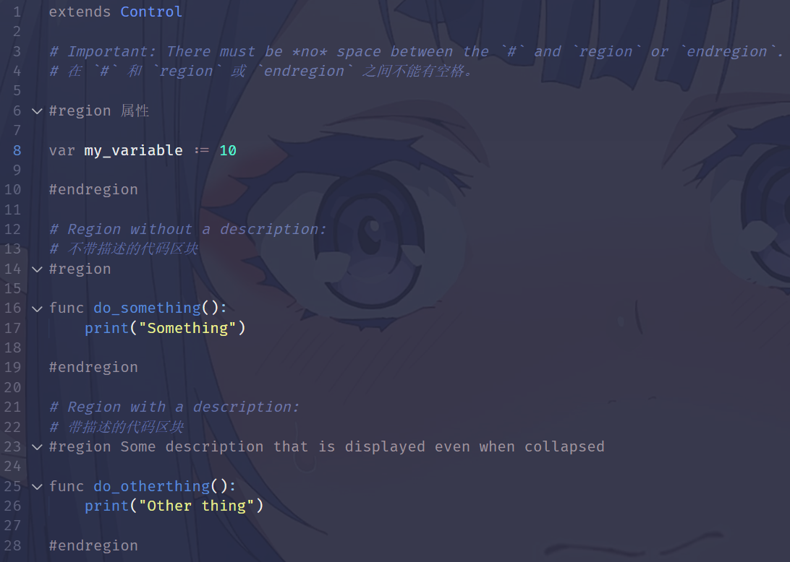
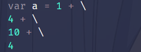
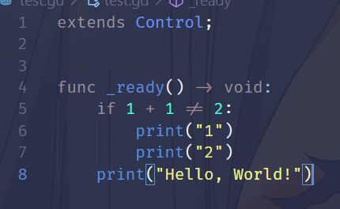

# 前言

**GDScript**是基于**Godot**游戏引擎环境的一种面向对象的高级编程语言

也就是说**GDScript**的代码在**Godot**的环境下才能够运行，为了方便学习我们首先需要了解一下该怎样运行**GDScript**脚本

# 选择编辑器

在学习GDScript之前需要选择一个合适的Godot编辑器


**如果需要用到C#脚本编写的插件或需要用到C#语言作为Godot的脚本语言（之一），则下载.NET版本，如果不需要使用C#则下载通常版本即可**

# 创建脚本

下载完Godot编辑器并新建一个项目之后，我们便可以新建一个GDScript脚本文件，以下两种方法都可以创建脚本，选择方便的来即可（创建的时候记得选择Node:Default模板）

## 在文件系统中创建脚本



## 在节点上创建脚本

这种方法创建的脚本会直接令脚本挂载到目标节点上


# 代码结构


**这是GDScript中最常见的一个代码结构，其中**

* 井号（`#`）开头表示这是一行注释，用于说明代码用途，井号后的文字在程序执行时都将被省略

* 其余部分则是源代码


## 1. `extends Node`


在这一行代码中，如果你使用的是Godot编辑器内置的脚本编辑器你可能会注意到

* `extends`是红色的：这表明它是GDScript中的一个**关键字**

* `Node`是绿色的：这表明它是一个**类**


> **关键字（keyword）** 指的是在GDScript中有特殊用途的单词，我们**不能**把它占用来作为变量名或方法名等标识符（identifier）的名字，比如你不能写一个叫`if`的变量，这是不被允许的\~
>
> **类（class）** 面向对象编程（OOP）的一个概念，它相当于是一个大家庭，里面有各种各样的成员，各自负责不同的功能，目标一致地完成某项任务


### **关键字`extends`**

`extends`在这里的意思是表明要让这个类（当前的脚本文件）**继承**自某个已有的类

> 就像是：我们要给这个大家族创建支系，新家族可以继承老家族的本领，和老家族的成员间来往，还能加入自己的特色，比如会唱歌、跳舞


### **类`Node`**

`Node` 是Godot中的一个**超级重要的基础的**类型，它是所有可被添加到场景对象的基类（BaseClass），Godot的游戏场景都是由一个个节点构建起来的。

比如这些常见的节点类型：

* `Node2D` （用于2D游戏）

* `Node3D` （用于3D游戏）

* `Control`（用于UI元素）

他们全都继承自`Node` ，像是同一个家族里的表亲一样，而`Node`则是他们共同的祖宗


所以这行代码表示：

**我们要给`Node` 这个大家族创建一个旁系**

> *（我们要创建一个类，这个类继承自`Node`）*

这意味着，我们当前编写的脚本会拥有`Node` 的所有能力，同时我们也能给它添加独属于自己的能力

***


## 2. `func _ready() -> void: pass`


在这段代码中，如果你使用的是Godot编辑器内置的脚本编辑器你可能会注意到

* `func` 是红色的：这表明它是一个关键字；

* `_ready` 是蓝色的：这表明它是一个标识符；

* `void` 是绿色的：虽然绿色在内置脚本编辑器通常表明一种类型，但是它比较特殊，它是一个**关键字** ；

* `pass` 是红色的：这表明它也是一个关键字；


> **标识符（identifier）** 是用于标识变量、方法、类等等成员的符号，相当于是给家庭成员起的一个名字


### **关键字`func`**

`func` 这个单词的意思是我们要声明一个方法(Method)，也可以叫函数( Function），他是类的成员之一，相当于是家庭成员能做的一件“事情”


### **标识符`_ready`**

`_ready` 作为标识符，是方法的名字，不过以 `_` 开头的名字一般代表 Godot 提供的“可覆盖方法”


### **关键字`void`**

`void` 这个单词的意思是表示这个函数**不会返回任何值**

> 就像你让某位家庭成员去买菜，他回来后不会跟你说买了什么～他只是默默完成任务


### **关键字`pass`**

`pass` 用来占位，不执行任何操作。

当你在定义函数或其他代码块时暂时还没写内容，就可以先写个`pass` ，表示“我知道这里需要代码，你别急，我在烧烤(思考)”

这样就不会报错

否则你会遇到如下错误

> `Expected indented block after function declaration.`
>
> *（函数声明后应有缩进块）*


### **`_ready()`方法**

`ready()`方法是属于`Node`类的一个可覆盖方法（Virtual Method），可以在子类中重写（override）实现自定义逻辑

* 它没有任何参数和返回值。

* `_ready()` 只会在节点及其子节点全部准备好后调用

* 它只会在每个节点上被调用一次

* 只会在第一次进入场景树时调用，如果当该节点从树中移除后重新添加，`_ready()` 方法不会被调用，除非使用`request_ready()`方法


`_ready()` 方法一般用于**初始化逻辑**

比如：加载资源、连接信号、设置初始状态


> **可覆盖方法** 也叫虚函数/虚方法（virtual）, 表示这个方法可以在子类中重写（override），实现与父类不同的逻辑，在GDScript中，**下划线开头**的方法，一般都是Godot 提供的“虚方法”，我们可以在自己的类里重写它来自定义逻辑


### 官方文档

> **● `void _ready() virtual`**
>
>
>
> 当节点“就绪”时被调用，即当节点及其子节点都已经进入场景树时。如果该节点有子节点，将首先触发子节点的 `_ready()` 回调，稍后父节点将收到就绪通知。
>
>
>
> 对应 `Object._notification()` 中的 `NOTIFICATION_READY` 通知。另请参阅用于变量的 `@onready` 注解。
>
>
>
> 通常用于初始化。对于更早的初始化，可以使用 `Object._init()`。另见 `_enter_tree()`。
>
>
>
> 注意：该方法对于每个节点可能仅调用一次。从场景树中移除一个节点后，并再次添加该节点时，将不会第二次调用 `_ready()`。这时可以通过使用 `request_ready()`，它可以在再次添加节点之前的任何地方被调用。
>
>
>
> #### 文档摘要
>
> * 当节点“就绪”时被调用（即：当节点及其所有子节点都加入场景树之后）
>
> * 如果该节点有子节点，**子节点的 `_ready()` 会先被调用**，然后才是父节点
>
> * 对应于 `Object._notification()` 中的 `NOTIFICATION_READY`
>
> * 通常用于初始化
>
> * 想更早初始化可以用 `_init()`，想更早响应节点加入场景树可使用 `_enter_tree()`
>
> * **注意：默认每个节点 `_ready()` 只会被调用一次**
>
> * 如果你将节点移除后又重新添加，可以使用 `request_ready()` 强制重新触发 `_ready()`

***

## 3. `func _process(delta: float) -> void: pass`

在这段代码中，如果你使用的是Godot编辑器内置的脚本编辑器你可能会注意到

* `delta` 是白色的：这表明它是变量标识符，是一个变量。在这里，它是`_process`方法的一个参数

* `float` 是绿色的：它是一个类型`float` ，在GDSctipt中表示的是浮点数（小数）类型。在这里，它是参数`delta`的类型


### **参数`delta`**

它是`_process(float)`方法的一个参数，是`float`浮点数类型

表示帧时间也就是从上一帧到当前帧之间经过了多少秒（时间增量）单位是秒，是一个极小的量

受设备性能影响，在`_process(float)` 方法中，每一帧它的值都是不同的

> **时间增量（delta time）** 表示在游戏主循环中，从上一帧到当前帧之间实际经过的时间，单位是秒。因为设备的刷新率和主循环的运行速度不同，每一帧的 `delta` 值也会有所不同。它能直接反映出每一帧的处理耗时，在需要让逻辑与帧率无关时非常有用！不过要注意，`delta` 是游戏内部的估算值，并不适合用来测量真实世界中的准确时间，想要更精准的时间信息，可以使用 `Time` 单例提供的方法


### **类型`float`**

它是GDScript中的一种基本内置类型，不能够被继承，它表明一个浮点数（floating-point），也就是带小数点的数字

像是`1.5` `3.14` `-0.01` 这样的数字都属于`float`


### **`_process(float)` 方法**

`_process(float)`是`Node`类的一个可覆盖方法，可以在自己写的类里重写它，实现属于自己的逻辑

* 它是帧处理函数，会在游戏主循环的每一帧调用

* 它接收一个`float`类型的参数`delta`，如上文所说，表示帧时间

* 它没有返回值

* 为了尽可能快地处理，时间增量`delta` 参数每一帧都会发生变化

* 可以使用`set_process(bool)`来开关帧处理

* 如果 `_process(float)` 被覆盖，帧处理将在 `_ready()` 被调用之前自动启用。

* `_process(float)` 只有当节点**在场景树中**才会被调用（不能是孤立节点）

* Godot 会根据 `process_priority` 来决定调用顺序：数值越小越先执行，同级的按照场景树顺序执行


`_process(float)` 一般用来处理 **持续更新的逻辑**

比如：玩家输入检测、每秒计时器、自动保存游戏进度

### 官方文档

> ●` `**`void _process(delta: float) virtual`**
>
>
>
> 在主循环的处理步骤中调用。每一帧都会尽快进行处理，因此表示自上一帧以来时间增量的 `delta`会发生变化。`delta`的单位为秒。
>
>
>
> 启用处理后才会调用该方法，覆盖该方法后会自动启用，可以使用 `set_process()` 开关。
>
>
>
> 处理按照 `process_priority` 的顺序进行，优先级取值越低越先调用。优先级相同的节点按照树顺序处理，即编辑器中从上到下的顺序（也叫前序遍历）。
>
>
>
> 对应 `Object._notification()` 中的 `NOTIFICATION_PROCESS` 通知。
>
>
>
> 注意：节点位于场景树中才会调用该方法（即不能是孤立节点）。
>
>
>
> 注意：运行帧率小于 `Engine.physics_ticks_per_second` / `Engine.max_physics_steps_per_frame` FPS 时 `delta`会比正常情况大。这样做是为了避免产生“死亡螺旋”。在这种情况下，由于每帧物理步骤数量的不断增加，性能会急剧下降。`_process()` 和 `_physics_process()` 都会受此影响。因此，请避免根据 delta 来测量真实世界的秒数。请使用 Time 单例的方法来实现此目的，例如 `Time.get_ticks_usec()`。
>
>
>
> #### 文档摘要
>
> * 在主循环的处理步骤中被调用。
>
> * 会尽可能在每一帧中执行，参数 `delta` 是上一帧到当前帧之间的时间，单位是 **秒**。
>
> * 重写该方法后，帧处理将自动启用
>
> * 可用 `set_process(bool)` 控制启用状态
>
> * 处理顺序受 `process_priority` 控制，数值越低优先级越高
>
> * 只有在节点进入**场景树**后才会触发 `_process(float)`
>
> * **低帧率时**，为了避免“死亡螺旋”问题，`delta` 会被放大， 所以不建议用它来精确测量真实时间

***


## 另一种样式

除了上面那种带有类型声明的代码结构，你有时候可能还会看到 **下面这种形式**的脚本



如果你在 **编辑器设置 → 文本编辑器 → 补全** 页面里，**没有勾选「添加类型提示」** 的话，通过模板创建的脚本就会如上图所示



在这个结构里，像`func _ready()`和`func _process(delta)`这样的方法，没有声明返回类型(比如`-> void`)或参数类型（比如 `delta: float`）


这并不是错误～而是 **GDScript 的动态类型特性**


换句话说，它允许你**不写出类型**，而在运行时再根据实际情况自动判断


这种写法虽然方便，但也有一些缺点：

* **缺少代码提示**，写代码的时候编辑器没法智能推断类型，提示会变少

* **更容易出错**，比如传错类型，可能会在运行时才发现问题

# 编写第一行代码

在刚刚，我们初识了代码结构


接下来使用上面的 **在节点上创建脚本** 方法让我们新建一个脚本，开始编写第一行代码吧


动手改改，我们试着让这个节点出生就说句话吧


**你可能需要用到这个方法:**

## **`print()`**

> ● **`void print(...) vararg`**
>
>
>
> 以尽可能最佳的方式将一个或多个任意类型的参数转换为字符串，并将其打印到控制台。
>
>
>
>
>
> 注意：请考虑使用 `push_error()` 和 `push_warning()` 来打印错误和警告消息，而不是 `print() `或 `print_rich()`。这将它们与用于调试目的的打印消息区分开来，同时还会在打印错误或警告时显示堆栈跟踪。另见 `Engine.print_to_stdout` 和 **应用 > 运行 > 禁用标准输出**。
>
> ### 文档摘要
>
> `print()`方法可以接收任意类型的参数，用逗号间隔，参数都会被转换为字符串打印到控制台
>
> 如果你要打印文字，记得要用双引号括起来（`"Hello!"`）
>
> 如果你想输出错误或警告，推荐使用 `push_error()` 或 `push_warning()`，这样不仅能区分普通打印，还能显示调用栈，超级方便！

## 示例


**如果要打印文字，双引号一定不能忘**

试着点一下右上角小三角运行一下，看一下控制台


# GDScript特性

## 注解

注解是 GDScript 中的一类特殊标记，用来修饰脚本或脚本中的代码，影响 Godot 引擎或编辑器对该脚本或代码所产生的效果。

注解均以 `@` 符号开头，加以注解名称而构成

比如可以将一个变量导出到编辑器中，令我们可以在编辑器中编辑它


## 注释

`#` 之后，所在行的所有内容都会被忽略，会视为注释进行处理。

> 在 Godot 的脚本编辑器中，一些特殊关键字会在注释中高亮显示以提醒用户：
>
> * **关键提示***（标红）*：`ALERT`、`ATTENTION`、`CAUTION`、`CRITICAL`、`DANGER`、`SECURITY`
>
> * **警告提示***（标黄）*：`BUG`、`DEPRECATED`、`FIXME`、`HACK`、`TASK`、`TBD`、`TODO`、`WARNING`
>
> * **一般提示***（标绿）*：`INFO`、`NOTE`、`NOTICE`、`TEST`、`TESTING`
>
> 这些关键字均大小写敏感，故需要全大写以保证能被引擎所识别：
>
> 
>
> 可在编辑器设置的 **文本编辑器 > 主题 > 注释标记** 部分中更改突出显示的关键字列表及其颜色。

## 文档注释

使用两个井号（`##`）而不是一个（`#`）来添加文档注释，它将出现在脚本文档和导出变量的检查器描述中。

文档注释必须直接放在可文档项（如成员变量）的上方，或者放在文件的顶部。详见后续的 [**文档注释**](12.doc-comments.md)  章节




## 代码区块

代码区块是一种特殊类型的注释，脚本编辑器将其理解为 *可折叠区块*，即在编写代码区块注释后，可以通过点击注释左侧出现的箭头来折叠和展开该区块。该箭头用一个紫色方块包围起来，以区别于标准的代码折叠。

语法如下：



## 行间语句接续

在GDScript中，一行语句可通过反斜杠（ `\` ）接续到下一行。将反斜杠加在一行语句末尾可将该行代码与下一行代码相衔接。如：


可按以下方式对单个语句行进行多行接续：



但是这样写，可读性相对较差，不建议使用

## 分号

GDScript 允许你在一行中写下多条语句（赋值、函数调用以及流程控制结构等），只需要用分号 `;` 分隔就可以


可读性较差，不建议使用

除此之外，你也可以用`;`表示语句的结束

```gdscript
var a = 1;
var b = 2;
var c = 3;
```

## 缩进语法

在 GDScript 中，**缩进就是语法的一部分**，它用来表示代码块的层级关系

缩进字符一般为空格或tab，**在同一个文件中不能混着用**，否则会报错：

> `Used tab character for indentation instead of space as used before in the file.`
>
> *（在文件中使用制表符作为缩进，而不是之前使用的空格。）*




在上面的代码示例中，`print("1")`和`print("2")` 缩进在 `if` 下面，所以都是属于`if`的代码块的

而`print("Hello, World!")`的缩进和 `if` 对齐，表示它**不属于 `if` 的判断体**，只是 `_ready()` 函数的普通一行。

所以缩进不只是为了好看，它真的真的会影响代码的运行逻辑

## 跨语言调用

GDScript和C#之间可以互相跨语言调用，这在使用不同语言的代码库时相当有用
