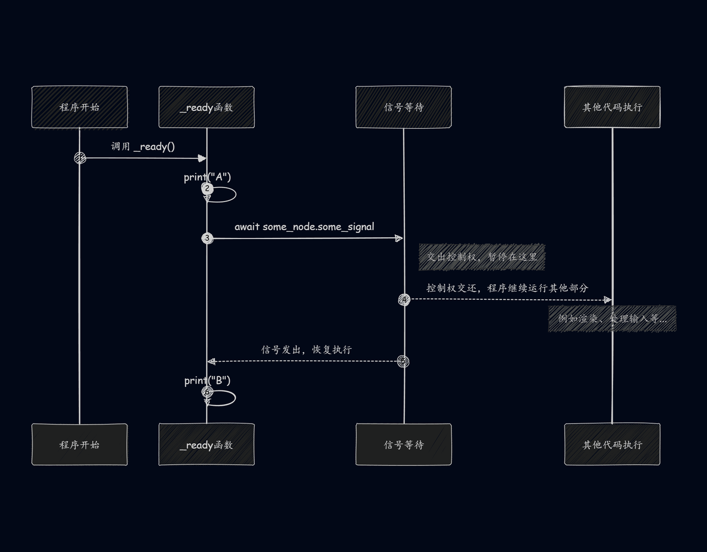

# 信号

信号`Signal`代表`Object`实例的某个信息，可以被变量引用，传递给函数

信号是来自于对象的一个事件，可以由**多个**来自不同对象的`Callable`监听，是在GDScript中运用观察者模式必不可少的一环

信号是值类型，默认值为没有绑定任何对象和信号的空信号`Signal()`


**同一个信号不允许和同一个`Callable`重复连接，除非使用 `CONNECT_REFERENCE_COUNTED`模式连接**


信号可以被多个`Callable`所监听，信号发出后连接该信号的所有`Callable`都将被调用


# 声明

信号的声明和变量不同，需要使用`signal`关键字，并且只能声明在类当中，作为**类的成员**

特别地，信号的声明和函数的声明极像，它可以有指定类型，指定数量的参数，但不能指定返回值；因此只有签名匹配的函数（或`Callable`）才能连接该信号

声明无参数的信号只需要在关键字后写上合法标识符即可，当然也可以像声明无参函数一样添加一个括号，而具有参数的信号则需要像声明函数一样在括号内填入参数列表，**信号不允许具有可选参数，参数必须在发出信号时传递**

```gdscript
signal my_signal # 声明无参数的信号
signal my_signal_2() # 声明无参数的信号，但加上括号
signal item_changed(item: String, amount: int) # 声明具有参数的信号
```


### 运行时创建信号

如果有必要，你也可以在运行时创建信号

使用`void add_user_signal(signal: String, arguments: Array = [])`方法，可以在游戏运行时动态创建一个信号，而使用方法也和定义在类中的信号相同

```gdscript
add_user_signal("hurt", [
        { "name": "damage", "type": TYPE_INT },
        { "name": "source", "type": TYPE_OBJECT }
])

# 等效于：signal hurt(damage: int, source: Object)
```

**运行时创建的信号只能使用`Object`下的相关方法发出、连接**

**运行时创建的信号可以被变量引用，可以以此方法使用`Signal`下的相关方法发出、连接该信号**

# 引用

信号可以被变量引用，也可以作为函数的参数，但无法使用变量创建

除了直接赋值，还可以使用构造函数来引用已有的信号

```gdscript
signal my_signal

var signal_ref = my_signal
var ctor_signal = Signal(self, "my_signal") # 必须使用已声明的信号名
```


**信号作为类的成员，大多情况下直接访问即可，不必特地其分配给一个变量**


# 发出信号

可以使用两种方法发出信号，发出信号后**所有**连接该信号的可调用体**都将被触发**，发出信号时必须传入该信号所必须的所有参数

* 从对象实例发出信号`Object.emit_signal(signal: StringName, ...)`，接收一个必选参数和可变参数：

  * 参数`signal`：存在于该对象的信号的名字

  * 可变参数的数量根据信号的签名而定

* 直接访问对象的信号并发出该信号`Signal.emit(...)`，接收可变参数，其数量取决于信号的签名

两个方法都接收一个可变参数列表，是发出该信号所必须的所有参数，需要和该信号的签名所匹配

信号发出后，所有连接到该信号的可调用体都将被触发，如果信号有参数可调用体的参数也会得到对应的值，**可调用体对应的函数会使用信号发出时所提供参数的值来执行逻辑**

也可以使用上述的方法手动发出内置信号

```gdscript
signal item_changed(item: String, amount: int)

func _ready():
    item_changed.connect(_on_item_changed) # 连接信号
    change_item("stone", 100) # 发出信号，会执行 _on_item_changed("stone", 100)
    change_item("wood", 200) # 发出信号，会执行 _on_item_changed("wood", 200)
    
func change_item(item: String, amount: int) -> void:
    item_changed.emit(item, amount)

func _on_item_changed(item: String, amount: int) -> void:
    print("item %s changed! amount: %s" % [item, amount])
    
```

# 连接

连接信号有两种方法

* 一种是从对象实例连接`Object.connect`，接收三个参数：

  * 参数一`signal`：存在于该对象的信号的名字

  * 参数二`callable`：要连接到该信号的可调用体实例

  * 参数三`flags`：可选的连接行为标志

* 一种是直接访问对象的信号连接`Signal.connect`，接收两个参数：

  * 参数一`callable`：要连接到该信号的可调用体实例

  * 参数二`flags`：可选的连接行为标志

两个方法都返回一个`Error`枚举，当信号多次连接到相同的`Callable`且`flags`不包含`CONNECT_REFERENCE_COUNTED`时，会返回`ERR_INVALID_PARAMETER`，并向调试器推送一个错误

```gdscript
func _ready():
        var button = Button.new()
        # 这里的 `button_down` 是 Button 类内置的一个 Signal 变体类型，因此我们调用 Signal.connect() 方法，而不是 Object.connect()。
        button.button_down.connect(_on_button_down)

        # 这假设存在一个“Player”类，它定义了一个“hit”信号。
        var player = Player.new()
        # 我们再次使用 Signal.connect() ，并且我们还使用了 Callable.bind() 方法，
        # 它返回一个带有参数绑定的新 Callable。
        player.hit.connect(_on_player_hit.bind("剑", 100))

func _on_button_down():
        print("按钮按下！")

func _on_player_hit(weapon_type, damage):
        print("用武器 %s 击中，造成 %d 伤害。" % [weapon_type, damage])
```

## `Object.connect()` 还是 `Signal.connect()`？

如上所示，推荐的连接信号的方法不是`Object.connect()`。

下面的代码块展示了连接信号的四个选项，使用该传统方法或推荐的 `Signal.connect()`，并使用一个隐式的`Callable` 或手动定义的 `Callable`。

```gdscript
func _ready():
        var button = Button.new()
        # 选项 1：Object.connect() 并使用已定义的函数的隐式 Callable。
        button.connect("button_down", _on_button_down)
        # 选项 2：Object.connect() 并使用由目标对象和方法名称构造的 Callable。
        button.connect("button_down", Callable(self, "_on_button_down"))
        # 选项 3：Signal.connect() 并使用已定义的函数的隐式 Callable。
        button.button_down.connect(_on_button_down)
        # 选项 4：Signal.connect() 并使用由目标对象和方法名称构造的 Callable。
        button.button_down.connect(Callable(self, "_on_button_down"))

func _on_button_down():
        print("按钮按下！")
```

虽然所有选项都有相同的结果（`button`的 `BaseButton.button_down` 信号将被连接到 `_on_button_down`）

* 选项 3：

  * 如果函数 `_on_button_down` 或信号 `button_down` 拼错了，**会在编辑器里直接报错（编译时报错）**，提前发现问题。

* 选项 1，2，4 ：

  * 只依赖于字符串名称，并且只能在运行时验证这两个名称，如果函数名或信号名拼错了，它将触发一个运行时错误。

**使用选项 1、2 或 4 的主要原因是，你是否确实需要使用字符串（例如，根据从配置文件读取的字符串，以编程的方式连接信号）。**

**否则，选项 3 是推荐的（也是最快的）方法。这同样也适用于`emit`/`disconnect`等其他信号相关的方法**


## `ConnectFlags`


除此之外，`connect`方法还接收一个可选参数，一个`ConnectFlags`枚举，指示以何种模式连接该信号

**因为是`flag`，因此模式是多选的，还记得之前的二进制运算符吗？使用`|`按位或运算符来组合模式**

* `ConnectFlags.CONNECT_DEFERRED`

  延迟连接会在空闲时触发 `Callable`（当前帧的末尾），不会立即触发。

  这类似于`Callable.call_deferred`

  ```gdscript
  signal my_signal

  func _ready():
      my_signal.connect(print_msg, ConnectFlags.CONNECT_DEFERRED)
      my_signal.emit()
      
  func print_msg():
      print("Signal emitted")
  ```


* `ConnectFlags.CONNECT_PERSIST`

  持久连接会在序列化对象时存储（比如使用 `PackedScene.pack()` 时）。在编辑器中，通过“节点”面板创建的连接总是持久的。


* `ConnectFlags.CONNECT_ONE_SHOT`

  一次性连接，会在触发后自行断开。(默认情况下信号发出后，对应的可调用体完成执行后不会自动断开连接)

  下面的代码中发出了五次信号，但只会`print`一条消息，因为使用了一次性连接

  ```gdscript
  signal my_signal

  func _ready():
      my_signal.connect(print_msg, ConnectFlags.CONNECT_ONE_SHOT)
      for i in 5:
          my_signal.emit()

  func print_msg():
      print("Signal emitted")
  ```


* `ConnectFlags.CONNECT_REFERENCE_COUNTED`

  引用计数连接可以多次分配给同一个 `Callable`。每断开一次连接会让内部计数器减一。信号会在计数器变为 0 时完全断开连接。

  这个模式允许你将同一个可调用体多次连接到同一个信号，并且**每断开一次连接**减少一次内部的计数器，为0时才会完全断开信号的连接

  下面的代码，重复连接了10次信号，而后发出了15次信号，运行后发现并没有出现可调用体已连接到信号的异常，并且只进行了10次`print`

  ```gdscript
  signal my_signal

  func _ready():
      for i in 10:
          my_signal.connect(print_msg, ConnectFlags.CONNECT_REFERENCE_COUNTED)
      for i in 15:
          my_signal.emit()

  func print_msg():
      print("Signal emitted")
      my_signal.disconnect(print_msg) # 断开连接
  ```

  你也可以组合标志，在调用完后自动断开连接，减少计数器

  ```gdscript
  signal my_signal

  func _ready():
      for i in 10:
          my_signal.connect(print_msg, ConnectFlags.CONNECT_REFERENCE_COUNTED | ConnectFlags.CONNECT_ONE_SHOT)
      for i in 15:
          my_signal.emit()

  func print_msg():
      print("Signal emitted")
  ```


# 断开连接

信号所连接的可调用体在被触发后不会自行断开连接（`CONNECT_ONE_SHOT`模式连接的除外）

因此，在必要情况下需要手动断开信号的连接

断开连接也有两种方法

* 一种是从对象实例断开连接`Object.disconnect`，接收两个参数：

  * 参数一`signal`：存在于该对象的信号的名字

  * 参数二`callable`：要断开的已连接到该信号的可调用体实例

* 一种是直接访问对象的信号断开连接`Signal.disconnect`，接收一个参数：

  * 参数一`callable`：要断开的已连接到该信号的可调用体实例

两个方法都是无返回值的，并且**如果断开一个未连接到该信号的可调用体，会生成一个错误**，因此在必要情况下需要使用`is_connected`方法进行检查


`Object`和`Signal`中都有`is_connected`方法

* `Object.is_connected`:

  * 参数一`signal`：存在于该对象的信号的名字

  * 参数二`callable`：要检查的可调用体实例

* `Signal.is_connected`:

  * 参数一`callable`：要检查的可调用体实例

如果指定的可调用体连接到了该信号，该方法会返回`true`，否则返回`false`


需要注意的是，**指向不同对象的相同方法的可调用体不是同一个实例**，因此要确保断开信号时使用的可调用体和连接信号时使用的可调用体**指向相同的对象和方法**

# 协程

有时候，我们希望代码**暂停一下，等某个事情发生了再继续往下执行**。

比如：等按钮被点击后再做下一步，等过去了一秒钟再做下一步，等某个动画播放完后再加载下一个场景

这时候，就可以用GDScript的**协程**来实现


## await

`await`关键字用于等待信号或协程函数

等信号发出或协程函数跑完后才会继续往下执行


一旦在函数体内用上了`await`，这个函数就变成了一个协程函数
它会暂停在`await`这一行，等着你指定的事件发生，然后再接着往下跑


举个例子，假设我们有一个`Button`节点

```gdscript
func await_button_pressed():
    print("等待按钮按下")
    await $Button.pressed
    print("按钮被按下")
```

调用上面的代码，会立即打印 "等待按钮按下"，然后暂停执行，等待用户按下按钮

一旦按钮被按下，会立即恢复执行并打印 "按钮被按下"


你可能还想看看是否过去了一秒，此时需要一个协程函数，并且需要返回一个状态

```gdscript
func is_onesec_passed() -> bool:
    await get_tree().create_timer(1.0).timeout
    return true
    
func wait_onesec() -> void:
    var is_passed = await is_onesec_passed()
    print("过去了一秒")
```

此时函数`wait_onesec`会暂停执行，等待`is_onesec_passed`执行完成，并请求它的返回值

`is_onesec_passed`函数会在节点树创建一个1秒钟的临时计时器，并等待它的`timeout`信号，一秒后它会返回`true`


需要注意的是，在请求协程函数的返回值时，如果不带`await`将会报错：

```gdscript
var is_passed = is_onesec_passed() # `is_onesec_passed`是一个协程函数，必须使用`await`来调用它
# 正确语法 var is_passed = await is_onesec_passed()

if is_onesec_passed(): # `is_onesec_passed`是一个协程函数，必须使用`await`来调用它
    pass
# 正确语法 if await is_onesec_passed(): 
```


如果不需要协程函数的返回值，直接异步调用就可以了，既不会阻止代码的正常运行，也不会让当前的函数变成协程函数：

```gdscript
func okay():
    wait_onesec()
    print("这行会立即输出")
```


如果`await`等待的不是协程函数也不是信号，则会立即返回对应的值，函数也不会将控制权转交回调用方：

```gdscript
func no_wait():
    var x = await get_five()
    print("这不会进行等待")

func get_five():
    return 5
```


也就是说，如果非协程函数返回的是信号，那么调用方就会等待那个信号

```gdscript
func get_signal():
    return $Button.pressed

func wait_button():
    await get_signal()
    print("按钮按下")
```

`get_signal`是一个非协程函数，但是它返回了一个信号

当我们使用`await`等待它的时候，实际上等待的是它返回的信号


## 控制权

程序在运行时，只能一次专注做一件事，这就是控制权的体现

```gdscript
func _ready():
    task_1()
    task_2()
```

这时候：

* `task_1()` 正在执行，它掌握了“控制权”，意思就是它说了算，程序必须等它做完。

* 做完了，它把“控制权”交回 `_ready()`，然后轮到 `task_2()` 开始。


当你使用 `await` 的时候，其实你在说：

> “我要等别人做完事，再继续我的流程，那我就先把控制权让出去，让其他代码/任务先跑吧（不耽误事）”

也就是说：

* 程序暂停了当前函数的执行

* 让出控制权，**先去处理其他函数、信号、渲染、动画……**

* 一旦你 `await` 的那个对象完成了（比如信号发出）

* 系统会悄悄把“控制权”还回来，从你暂停的地方继续往下跑


普通函数调用的等待，和使用`await`的等待区别在于：

* 普通函数：你端咖啡、收钱、洗杯子、做菜……每件事都得你亲自完成，别的顾客只能等（你占有控制权）

* 协程+await：你把订单交给后厨，先去招呼下一个顾客（你把控制权交出去了）

普通函数执行是“代码自己跑完就继续”，而 `await` 是“等某个外部事件发生了才继续”。

| 特点       | 普通函数        | 使用 `await` 的函数（协程）     |
| -------- | ----------- | ---------------------- |
| 是否会中途暂停  | 否           | 是，会在 `await` 暂停        |
| 何时继续往下执行 | 马上（顺序执行）    | 只有等 `await` 的对象完成      |
| 等的是谁     | 自己的代码跑完     | 某个**信号** 或 **协程函数** 跑完 |
| 控制权是否释放  | 不释放，会卡住当前函数 | 暂停时释放控制权，其他代码可以继续运行    |


**控制权就是“接下来谁能继续执行代码”的决定权。**  
使用 `await` 就是告诉系统：“我暂停一下，把决定权让出去，等某个事完成我再继续”


下面是 Mermaid 的流程图，它会清楚展示出下面代码控制权的**暂停 → 等待信号 → 恢复执行**的整个过程：

```gdscript
func _ready():
    print("A")
    await some_node.some_signal
    print("B")
```




# 练习

下面的所有练习，你都需要按需额外编写一个监听函数或使用lambda函数来连接练习中的信号以进行验证

1. 定义一个`value_changed(old_value: int, new_value: int)`信号，、一个信号广播函数`change_value(new_value: int)`、一个成员变量`value:int`，每次调用`change_value`
   ，比较当前值和新值，若不同则发出信号（带上新旧值），然后更新变量

2. 定义一个 `max_updated(previous_max: float, new_max: float)` 信号，有一个函数 `submit_value(n: float)`，初始有一个 `current_max := -INF`，每次调用 `submit_value()`，若提交的值比当前最大值还大，则发出信号并更新最大值。

3. 有一个数组`numbers: Array[int]`，定义一个 `length_changed(from: int, to: int)` 信号，编写 `add_number(n: int)` 函数：若`n`不存在于数组中则添加进数组，若添加后数组长度发生变化，发出信号（传入旧长度与新长度）

4. 有一个布尔变量 `is_active`，定义信号 `active_state_changed(active: bool)`，编写函数 `set_active(new_state: bool)`：如果状态变了，就发出信号

5. 有一个 `String` 类型变量 `name`，定义信号 `name_changed(log: String)`，编写函数 `rename_to(new_name: String)`，若发生变化，则生成一个日志（例如 `"名称从 A 改为 B"`），发出信号
